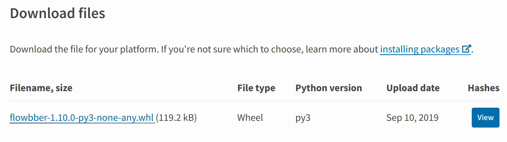
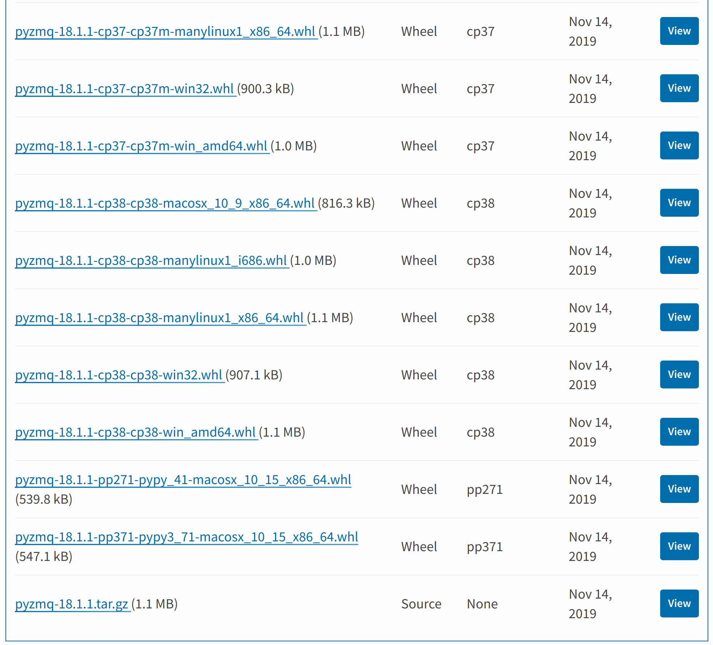

================
Python Packaging
================

*Empaquetamiento y distribución de código en Python*

.. image:: images/python.svg

:Autor: Carlos Jenkins, KuraLabs S.R.L
:Email: carlos.jenkins@kuralabs.io
:Fecha: 30 de Enero, 2020

Introducción
============

Ok, hice un código bien chiva.

Cómo hago para que otras personas puedan usarlo?

Agenda
======

- Cómo empaqueto?

  - Versión?
  - Descripción?
  - Paquetes?
  - Requerimientos?
  - Assets?
  - Ejecutables?

- En qué formato publico?
- En dónde lo publico?
- Cómo lo publico?
- Preguntas.

Cómo empaqueto?
===============

Respuesta: ``setup.py`` y `setuptools`_.

.. _setuptools: https://setuptools.readthedocs.io/

.. code-block:: python3

   from setuptools import setup

   setup(
       name='mypackage',
       version='1.0.0',
       author='KuraLabs S.R.L',
       author_email='info@kuralabs.io',
       description='Such an awesome package!',
       long_description='Place here what will be shown in project page!',
       url='https://github.com/kuralabs/mypackage/',
       packages=[
           'mypackage',
           'mypackage.args',
           'mypackage.hello',
       ],
       install_requires=[
           'requests',
           'colorlog',
       ],
   )

Cómo empaqueto? : Versión
=========================

Dónde pongo la versión?

4 lugares:

- ``setup.py`` -> Versión del paquete.
- ``__init__.py`` -> Versión en tiempo de ejecución o importación.
- ``args.py`` -> ``myprograma --version`` ??
- ``conf.py``-> Si se usa documentación con Sphinx.

Debe haber un único lugar.

Cómo empaqueto? : Versión
=========================

Dónde pongo la versión? En el ``__init__.py``:

.. code-block:: python3

   __author__ = 'KuraLabs S.R.L'
   __email__ = 'info@kuralabs.io'
   __version__ = '1.10.0'

Cómo la cargo?

- ``args.py`` la importo relativa: ``from . import __version__``
- ``conf.py`` instalo el paquete en el virtualenv y la importo absoluta:
  ``from mypackage import __version__``.
- ``setup.py`` la parseo.

Cómo empaqueto? : Versión
=========================

Parseo?

.. code-block:: python3

   def find_version(filename):
       import re
       content = read(filename)
       version_match = re.search(
           r"^__version__ = ['\"]([^'\"]*)['\"]", content, re.M
       )
       if not version_match:
           raise RuntimeError('Unable to find version string.')
       return version_match.group(1)

Cómo empaqueto? : Versión
=========================

.. code-block:: python3

   setup(
       version=find_version('lib/mypackage/__init__.py'),
   )

Cómo empaqueto? : Descripción
=============================

Descripción en el ``setup.py`` se mostrará en la página del proyecto.

Y mi README?

.. code-block:: python3

   setup(
       long_description=read('README.rst'),
   )

No olvidar poner el README en el ``MANIFEST.in``!

Cómo empaqueto? : Paquetes
==========================

.. code-block:: python3

   setup(
       packages=[
           'mypackage',
           'mypackage.args',
           'mypackage.hello',
       ],
   )

Especificar cada uno de los módulos?!!!!!

Cómo empaqueto? : Paquetes
==========================

Setuptools ayuda:

.. code-block:: python3

   from setuptools import find_packages

   setup(
       packages=find_packages('.'),
   )

Cómo empaqueto? : Paquetes
==========================

Mejor los paquetes en su propio directorio?

.. code-block:: python3

   from setuptools import find_packages

   setup(
       package_dir={'': 'lib'},
       packages=find_packages('lib'),
   )

Cómo empaqueto? : Requerimientos
================================

.. code-block:: python3

   setup(
       install_requires=[
           'requests',
           'colorlog',
       ],
   )

Y mi ``requirements.txt``?

Cómo empaqueto? : Requerimientos
================================

Lo parseo :D

.. code-block:: python3

   def find_requirements(filename):
       import string
       content = read(filename)
       requirements = []
       ignored = []
       for line in content.splitlines():
           line = line.strip()
           if line.startswith('#') or not line:
               continue
           if line[:1] not in string.ascii_letters:
               ignored.append(line)
               continue
           requirements.append(line)
       return requirements

Cómo empaqueto? : Requerimientos
================================

Y lo puedo usar así:

.. code-block:: python3

   setup(
       install_requires=find_requirements('requirements.txt'),
   )

No olvidar poner el ``requirements.txt`` en el ``MANIFEST.in``!

Cómo empaqueto? : Assets
========================

Dónde los pongo?

.. code-block:: text

   lib/
   └── mypackage
       ├── __init__.py
       ├── args.py
       └── data
           └── config.json

Cómo empaqueto? : Assets
========================

Se empaquetan con ``package_data``.

.. code-block:: python3

   setup(
       package_data={
           'mypackage': ['data/*'],
       },
   )

Cómo empaqueto? : Assets
========================

Se cargan con `pkg_resources`_.

.. _pkg_resources: https://setuptools.readthedocs.io/en/latest/pkg_resources.html#basic-resource-access

Dos modos:

- Obtener path.
- Obtener contenido (binario).

Cómo empaqueto? : Assets
========================

Obtener path:

.. code:: python3

   from pathlib import Path
   from pkg_resources import resource_filename

   filepath = Path(resource_filename(
       __package__, 'data/images/myimage.png'
   ))

Cómo empaqueto? : Assets
========================

Obtener contenido:

.. code:: python3

    from json import loads
    from pkg_resources import resource_string

    content = loads(resource_string(
        __package__, 'data/defaults.json'
    ).encode('utf-8'))

Cómo empaqueto? : Ejecutables
=============================

Usando entrypoints! Así usamos el ``__main__.py`` también!

.. code-block:: python3

   setup(
        entry_points={
            'console_scripts': [
                'myexec=mypackage.__main__:main'
            ],
        },
   )

Cómo empaqueto? : Ejecutables
=============================

O bien old school:

.. code-block:: python3

   setup(
        scripts=['bin/myexec'],
   )

Más información aquí:

https://python-packaging.readthedocs.io/en/latest/command-line-scripts.html

En qué formato publico?
=======================

Respuesta: Wheel y Source.

.. code:: bash

   python3 setup.py bdist_wheel
   python3 setup.py sdist

Ojo con el ``MANIFEST.in``!!!!

En qué formato publico?
=======================

En qué formato publico?
=======================

En dónde lo publico?
====================

Respuesta: `PyPI`_, o un PyPI propio! Cómo `pypiserver`_.

.. _PyPI: https://pypi.org/
.. _pypiserver: https://pypi.org/project/pypiserver/

En dónde lo publico?
====================

Servidor PyPI local? Fácil:

.. code:: bash

   docker run -p 8080:8080 -d pypiserver/pypiserver:latest

Cómo lo uso?

.. code:: bash

   pip3 install --index-url http://localhost:8080/simple/ PACKAGE [PACKAGE2...]

En dónde lo publico?
====================

Cómo lo configuro global para mi usuario?

.. code:: bash

   pip3 config --user set global.index-url http://localhost:8080/simple/

Lo anterior escribe la configuración en:

.. code:: bash

   ~/.config/pip/pip.conf

Cómo lo publico?
================

Listo. Tengo mi paquete, cómo lo subo a PyPI?

Respuesta: `Twine`_.

.. _Twine: https://pypi.org/project/twine/

.. code:: bash

   sudo pip3 install twine

.. code:: bash

   twine upload --username myuser dist/mypackage-x.y.z.tar.gz
   twine upload --username myuser dist/mypackage-x.y.z-py3-none-any.whl

Cómo lo publico?
================

Si uso un PyPI propio?

.. code-block:: bash

   nano ~/.pypirc

Escribimos:

.. code-block:: text

   [distutils]
   index-servers =
       local

   [local]
   repository : http://localhost:8080/legacy
   username : YOUR.EMAIL@EMAIL.COM
   password : YOUR.MYPYPI.PASSWORD

Cómo lo publico?
================

Subimos a nuestro PyPI propio con:

.. code-block:: text

   twine upload -r local dist/mypackage-x.y.z-py3-none-any.whl

¿Preguntas?
===========

Muchas gracias!

https://carlos.jenkins.co.cr/presentations/packaging

:Autor: Carlos Jenkins, KuraLabs S.R.L
:Email: carlos.jenkins@kuralabs.io
:Web: https://kuralabs.io/
